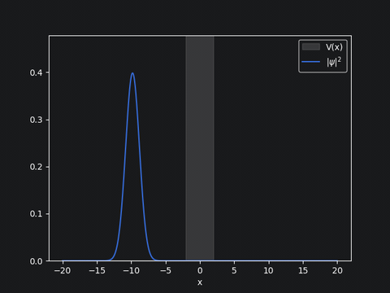
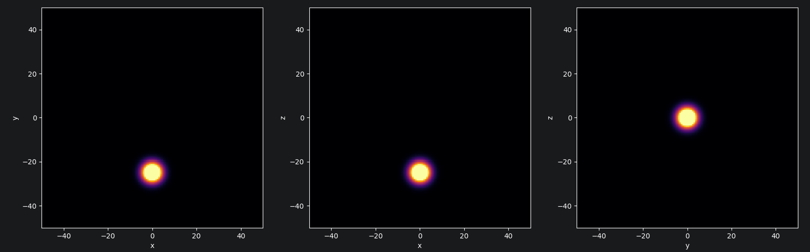
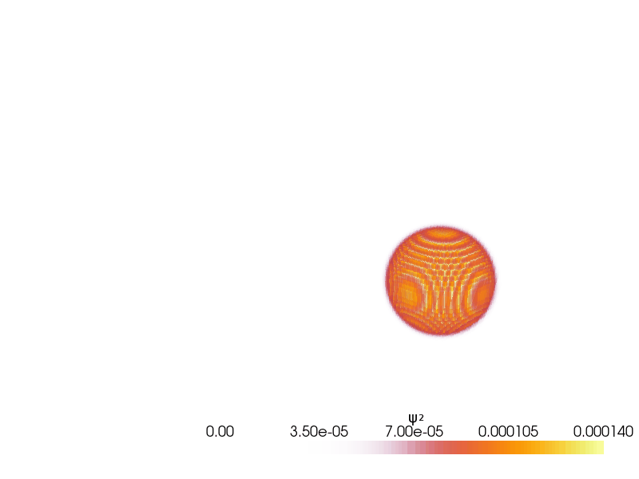

# Quantum scattering theory

Численное моделирование квантового рассеяния гауссовых пакетов на потенциалах.<br>
Включает прямую задачу рассеяния (эволюция волновой функции во времени) и обратную задачу восстановления потенциалов в пространстве (формфактор).


## Структура проекта

| Файл / папка                | Описание                                                                                                                                   |
|-----------------------------|--------------------------------------------------------------------------------------------------------------------------------------------|
| `1d_prototype/`             | Отладочный одномерный прототип.<br/> Туннелирование на прямоугольном барьере (схема Кранка-Николсона)                                      |
| `- 1d_wavepacket.ipynb`     | Симуляция и визуализация прохождения барьера                                                                                               |
| `3d_scattering/`            | Основная трехмерная задача (Split-Operator + FFT)                                                                                          |
| `- radial_wavepacket.ipynb` | Симуляция и визуализация рассеяния на потенциале Юкавы                                                                                     |
| `- partial_expansion.ipynb` | Парциальное резложение и сопоставление с результатами моделирования.<br/> Решение задачи формфактора для распределенного потенциала Юкавы. |
| `*.gif   `                  | Результаты моделирования. Анимации.                                                                                                        |
| `report.pdf`                | Текстовый отчет.                                                                                                                           |

### Для запуска Python:
```bash
pip install -r requirements.txt
jupyter notebook
```

### Порядок запуска: 
1. `1d_prototype/1d_wavepacket.ipynb` - по желанию. 1D прототип.
2. `3d_scattering/radial_wavepacket.ipynb` - расчет эволюции волнового пакета, получение результатов моделирвоания для сопоставления с теорией.
3. `3d_scattering/partial_expansion.ipynb` - сопоставление с асимптотическим разложением и обратная задача по последним кадрам симуляции.

## Ключевые результаты
1. Реализовано моделирование на одномерной задаче туннелирования через прямоугольный барьер. 
2. Реализовано трехмерное моделирование рассеяния гауссова пакета на потенциале Юкавы с использованием поглощающих граничных условий. 
3. Выведено и решено дифференциальное уравнение для фаз парциального разложения.
4. Проведено сопоставление результатов моделирования с аналитическим предсказанием в дальней зоне. 
5. Решена обратная задача: по эффективному сечению рассеяния в ближней зоне восстановлен радиус действия потенциала Юкавы. $R_{\text{fit}} = 1.93$, при заложенном $R=2.00$. (погрешность $4\%$).

## Отчёт
Полный текст отчета представлен в файле `report.pdf`.

## Демонстрация

### 1D Туннелирование


### 3D Рассеяние (проекции)


### 3D Объемная анимация



